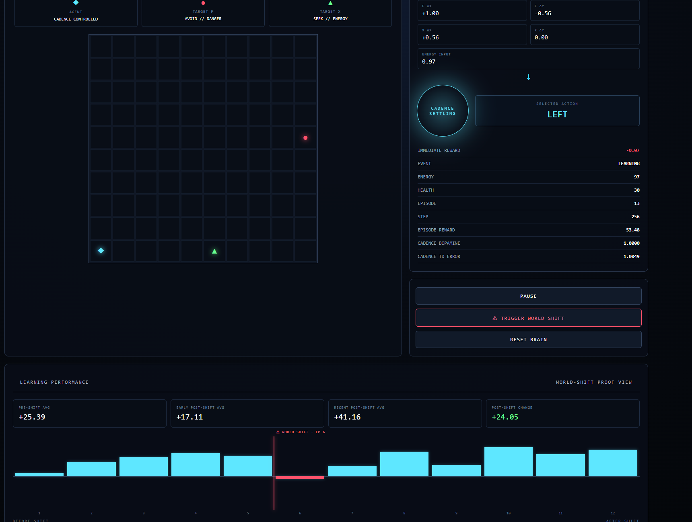

# CADENCE // SURVIVAL



### Live World Shift Result

**Pre-Shift Avg: +25.39 → Early Post-Shift: +17.11 → Recent Post-Shift: +41.16 → Post-Shift Change: +24.05**

*Example live run: WORLD SHIFT triggered at Episode 6. The same Cadence brain continued running without an intentional brain reset.*


> A live adaptive survival arena powered by a persistent Cadence brain.


CADENCE // SURVIVAL is an interactive demo built for the Cadence Brain Challenge.


Instead of showing Cadence making decisions in a static environment, this project changes the meaning of the environment while the agent is still running.


The challenge for the brain is simple:


**Can the same agent continue operating when the rules it learned suddenly become wrong?**


---


## The Arena


A Cadence-controlled agent moves through a 10x10 survival arena.


There are two targets:


- `● TARGET F` — initially ENERGY

- `▲ TARGET X` — initially DANGER

- `◆ AGENT` — controlled by Cadence


In the normal world, the agent is rewarded for moving toward and collecting F while being encouraged to avoid X.


The dashboard exposes the process live:


**Perception Vector → Cadence Brain → Selected Action → Reward → Learning Signal**


The available actions are:


- UP

- DOWN

- LEFT

- RIGHT

- WAIT


---


## World Shift


The key feature of the project is the manual:


### ⚠ WORLD SHIFT


During a live run, the environment can suddenly reverse its rules.


Before the shift:


`● F = SEEK / ENERGY`


`▲ X = AVOID / DANGER`


After the shift:


`● F = AVOID / DANGER`


`▲ X = SEEK / ENERGY`


The important part is that the running Cadence brain is **not reset when the world changes**.


The same brain continues receiving observations, actions, rewards, and outcomes under the new rules.


This creates an observable online adaptation experiment rather than simply restarting training in a new environment.


---


## Live Cadence Decision Pipeline


The dashboard exposes information from the running system instead of hiding the agent behind an animation.


It displays:


- normalized perception vector

- selected Cadence action

- immediate reward

- current event

- energy

- health

- episode

- step

- cumulative episode reward

- Cadence dopamine diagnostic

- Cadence TD-error diagnostic


The goal is to make the interaction between the environment and Cadence visible in real time.


---


## World-Shift Proof View


Completed episode rewards are recorded on the performance graph.


The dashboard permanently marks the episode where WORLD SHIFT occurred and compares performance across the transition.


It reports:


- **Pre-Shift Average**

- **Early Post-Shift Average**

- **Recent Post-Shift Average**

- **Post-Shift Change**


The episode containing the actual shift is treated as a transition episode because it may contain experience from both rule sets.


This makes the before/after comparison easier to inspect without pretending that the transition episode belongs entirely to either environment.


---


## Example Run


One live run produced:


| Metric | Reward |

| --- | ---: |

| Pre-Shift Average | +25.39 |

| Early Post-Shift Average | +17.11 |

| Recent Post-Shift Average | +41.16 |

| Post-Shift Change | +24.05 |


WORLD SHIFT was triggered at Episode 6.


The immediate post-shift performance was lower than the pre-shift average, followed by substantially stronger reward in the recent post-shift window.


This is an example of a recovery/adaptation pattern observed during a live run.


It should not be interpreted as proof that retaining a continuous brain will always outperform resetting one. The purpose of the demo is to make online behavior under changing reward semantics visible and experimentally testable.


---


## Why Cadence?


This project is designed around a property that is difficult to communicate with a conventional static AI demo:


**learning while the system is operating.**


Cadence receives the current perception vector and reward feedback while the simulation continues.


The world shift then deliberately invalidates the original target semantics.


Instead of replacing the agent with a newly trained model, CADENCE // SURVIVAL keeps the same running brain and lets the consequences of the changed environment become visible through its subsequent decisions and reward history.


---


## Project Structure


```text

cadence-survival/

│

├── brain.py

│   Cadence brain configuration and action interface

│

├── world.py

│   10x10 survival environment

│

├── demo.py

│   Flask simulation server and live dashboard

│

└── README.md

&#x20;   Project documentation

